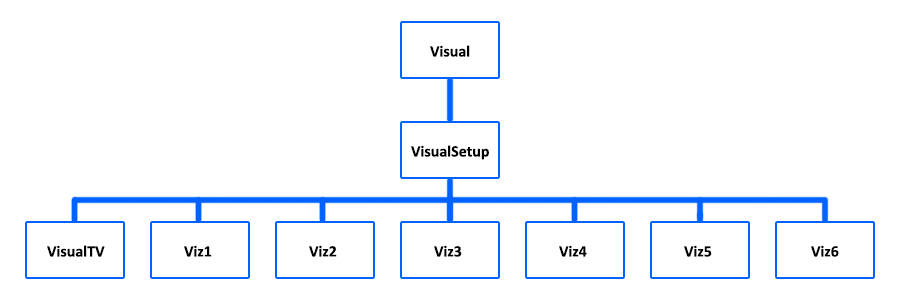

# Music Visualiser Project

### Name & Student Number: 

Ryan Deguara - C20309873  
Conor Davis - C20441826  
Luke Hughes - C20487654  

## Instructions
- Fork this repository and use it a starter project for your assignment
- Create a new package named your student number and put all your code in this package.
- You should start by creating a subclass of ie.tudublin.Visual
- There is an example visualiser called MyVisual in the example package
- Check out the WaveForm and AudioBandsVisual for examples of how to call the Processing functions from other classes that are not subclasses of PApplet

# Description
When you first open our project, you will be greeted by a television sitting on a table within your own screen, a television that will adapt to the size of your own screen, with buttons that work.

The main focus for this assignment was to have a television visualisation taking inspiration from the Rap God music video, to get that similar feeling and environment when you use our work to support our chosen song, along with making the visuals dynamic in relation to screen size. 

In the [video](https://www.youtube.com/watch?v=XbGs_qK2PQA), you can see him appear on the TV with some cool colour visualization in the background and we felt that this would be a good idea to base our project around. We developed a TV with six different visuals that appear on the screen, along with buttons on the TV that you can interact with to change the visual or to pause / play it. We each created two different visualizations each to give a plethora of options to use to visualize the song as it reaches over six minutes in length. 

Alongside this, we have made almost everything completely responsive down to 500x500px resolution. This added a complex layer to everything we did, as not only did we have to make sure the TV was working, both the visuals inside the screen and the buttons, we had to make sure they adapted to whatever resolution was being used due to fullscreen. We felt that few resolutions would have lower than 500 pixels in either height or width and getting any lower would make our assignment unfeasible, so on the off chance it would happen, the TV visual would be disabled. This has even been tested on resolutions as far up as even 3440x1440p, an ultra-wide monitor resolution.

# Instructions
When you start the visualizer, the song will automatically start playing and the first of six visuals will respond to the music. We made the main functionality around the TV graphic, so:

Power Button (Big) --> Pause / Play the Music  
Previous Channel (Smaller Left) --> Previous Visualization  
Next Channel (Smaller Right) --> Next Visualization  

Do be aware that you can only pause / play the music obviously until the song is over and if you wish to restart the song once it has finished, use the spacebar which has pause / restart functionality. You can also change the visuals using the keys 1-6 if you feel like it as well.

There is a video below showing us cycle through the visualizations with the buttons, along with instructions in this video on how to use them.

# How It Works
For this assignment, we have a main visual setup class, a tv visual class that contains our television graphics, along with six different classes for each of our visualizations.

Inheritance Tree:

### Visual Setup
Our main visual class is called VisualSetup and it extends from Visual.java. This is the class that our code revolves around. In this class you will find a number of important methods and variables used through the various visualization classes, such as the PVectors, one of which is used to calculate the border from the television screen to the edge of the visualization, and also the mode variable, which is used to control which visualization is currently being displayed on the TV.

The settings method contains the controls for the size of the visualisation, which by default is set to fullscreen with a backup size function that should be 500x500 at the very minimum. If it needs to go below this resolution for some reason, the TV graphics will be disabled.

The keyPressed method contains the code that allows the functionality for pressing 1-6 to change the visuals outside of our graphics, along with the spacebar for backup external control over the music playing.

The setup method contains the main configurations for the project, including the audio, the PVectors, and declaring the visualization objects, which will pass the necessary parameters to make the visualizations work, especially in sync with the television graphics.

The draw method is used to display both the television graphics and the visualizations by calling the render method of the respective object, with the visualization being rendered depending on the mode variable value.

The mouseClicked method contains the controls for the television buttons you will see on your screen. We initially tried to implement this in the VisualTV class but discovered that this particular method must be present in the same file as the draw method, making this not possible. The first if statement is used to control the big power button, which pauses and plays the music, the second if statement is used to control the left smaller button, which goes to the previous visualization and finally, the third if statement is used to control the right smaller button, which goes to the next visualization.

Each visualization class, including VisualTV, extends from this class, as shown by the above inheritance tree.

### Visual TV
This class contains the workings for our television graphics, which include the screen that the visuals are displayed on, the frame of the TV which includes the three functioning buttons (and also some immersive audio jacks with accurate colours for line in and line out), and the desk which the television sits on and the background.

The render method is used to render the television, which contains an if statement that will limit the graphics to only display once both the width and height are above 500 pixels.

### Visualizations (Viz)
These classes contains each persons workings for their own visualizations. The constructors for each class only contain passed parameters necessary for matching the visualizations to our dynamic sizing of the television screen, including various PVectors.

Once again, the render method is used through each one to code our drawings and bring them to life.

# What We Are Proud Of
We are most proud of how we came together at multiple times over the last few weeks to really work together to make sure that we were on the same page. In our future careers, we will most certainly be faced with working in teams with other programmers, and this experience has helped immensely with gaining experience in working together with others, coming to compromises and discussions over what should be done next.

We are also really proud of how the project turned out as we spent a lot of time working together but also individually to make the best vizualisations that we could in the time frame that we had and are happy how the vizualisations correspond to the music. We feel that we did the infamous Rap God song justice to Eminem as we took inspiration from the video and translated it well into our project to make the best vizualisations that we could come up with.

All in all, with the combination of our television graphics, how our visualizations look and how they adapt to the screen, how clean our code is, we think we've done a good job.

# Video
  

[Backup Link on Vimeo](https://vimeo.com/706579092)

